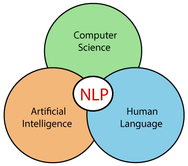

<h1 align="center">NLP Introduction</h1>

 
  

<!-- TABLE OF CONTENTS -->
<h2 id="table-of-contents"> Table of Contents</h2>

  
Table of Contents

  <ol>
    <li><a href="#overview"> ➤ Overview Computational Linguistics</a></li>
    <li><a href="#history"> ➤ History Of NLP </a></li>
    <li><a href="#why"> ➤ WHY NLP?</a></li>
    <li><a href="#uses"> ➤ Uses of NLP</a></li>
  </ol>

<!-- Overview Computational Linguistics -->
<h2 id="overview"> Overview Computational Linguistics</h2>

 
  Computational Linguistics is field that combines Computer Science, linguistics and artificial intelligence to develop Computational models for processing, and generating natural language.

 
  

 
  Computational Linguistics involves developing algorithms and techniques that allows computer to understand,generate and process human language. 

##### Uses below techniques to analyze large amount of textual data

* Statistics
* Machine Learning
* Deep Learning

##### The applications of Computational Linguistics

<table>
  <tbody>
    <tr>
      <td align="center" valign="top" width="14.28%"> <b>NLP</b> </td>
      <td align="center" valign="top" width="14.28%"> <b>Machine Translation</b> </td>
     <td align="center" valign="top" width="14.28%"> <b>Speech Recognition</b> </td>
      <td align="center" valign="top" width="14.28%"> <b>Sentiment Analysis</b> </td>
      <td align="center" valign="top" width="14.28%"> <b>Text Classification</b> </td>
      <td align="center" valign="top" width="14.28%"> <b> Information Retrieval</b> </td>
  </tbody>
</table>

(<a href="#readme-top">back to top</a>)

<!-- History Of NLP -->
<h2 id="history"> History Of NLP </h2>

 

  #### Key milestones in history of NLP

- <b>Early Work: In the 1950s:</b>
  - `research Began` — exploring the idea of using computers to process natural language.
  - `foundation` — This work laid the foundation for the field of computational linguistics.
- <b>Chomsky's Theory: In 1960s:</b>
  - `Noam Chomsky` — Noam Chomsky proposed a theory of generative grammar.
  - `Theory` — Argued that the structure of language is innate and can be represented by a set of rules.
- <b>Rule-Based Systems: In 1970s:</b>
  - `Rules Creation` —  Researchers began developing rule-based systems for processing natural language.
  - `Theory` — These systems used hand-crafted rules to analyze and generate text.
- <b>Statistical Methods: In 1980s & 1990s:</b>
  - `Work` —   Researchers began using statistical methods for natural language processing.
  - `Approach` — This approach involved training models on large datasets of text and using the models to make predictions.
- <b>Machine Learning: In 2000s:</b>
  - `Techniques` —  Machine learning techniques such as deep learning became popular
  - `Evolution` — NLP tasks such as language modeling, text classification, and machine translation.
- <b>Current Developments:</b>
  - `Evolution` — Today, NLP is a rapidly growing field with a wide range of applications, including chatbots, virtual assistants, sentiment analysis, and language translation.

(<a href="#readme-top">back to top</a>)

<!-- WHY NLP? -->
<h2 id="why">  WHY NLP? </h2>
There are many reasons why Natural Language Processing (NLP) is important
<ul>
  

<b>Understanding Human Language</b>

    <code>NLP allows computers to understand and process human language which is essential for building intelligent systems that can interact with humans.</code>
  

  

<b>Efficiency and Automation</b>

  <code>NLP can automate many tasks that would otherwise require human input, such as text classification, sentiment analysis, and language translation. This can save time and resources and improve efficiency</code>
  

  

<b>Insights and Knowledge</b>

  <code>NLP can analyze large amounts of textual data to extract insights and knowledge that can inform decision-making in areas such as healthcare, finance, and social media.</code>
  

  

<b>Accessibility</b>

  <code>NLP can make information more accessible to people who speak different languages or who have disabilities that affect their ability to read or write.</code>
  

   

<b>Innovation</b>

  <code>NLP is a rapidly evolving field that is driving innovation in areas such as chatbots, virtual assistants, and voice-enabled devices.</code>
  

  
</ul>

(<a href="#readme-top">back to top</a>)

<!-- Uses of NLP -->
<h2 id="uses"> Uses of NLP</h2>

Natural Language Processing (NLP) has many uses across various industries and domains. Here are some of the most common applications of NLP

1. <b>Speech Recognition</b>
    + `NLP is used to recognize and transcribe spoken language, which is essential for applications such as voice assistants and automatic transcription`

2. <b>Chatbots and Virtual Assistants </b>
    + `NLP is used to build chatbots and virtual assistants that can understand natural language queries and provide relevant responses.`

3. <b>Text Classification</b>
    + `NLP is used to classify text into predefined categories, such as spam/not spam, positive/negative sentiment, or topic classification`
  
4. <b>Information Extraction</b>
    + `NLP is used to extract structured information from unstructured text data, such as extracting contact information from resumes`

5. <b>Sentiment Analysis</b>
    + `NLP is used to analyze text data, such as social media posts and customer reviews, to determine the sentiment or emotion expressed`
  
6. <b>Language Translation</b>
    + ` NLP is used to translate text from one language to another, which is essential for communication and information sharing across different cultures and regions.`
  
7. <b>Text Summarization</b>
    + `NLP is used to summarize large volumes of text, such as news articles and research papers, into shorter, more digestible formats.`
  
8. <b>Named Entity Recognition</b>
    + `NLP is used to identify and classify named entities, such as people, organizations, and locations, in text data`
  

(<a href="#readme-top">back to top</a>)
