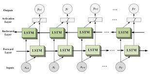

<h1 align="center">Bidirectional LSTM</h1>

 
  

<h2 id="intro">Introduction</h2>

 
  Bidirectional LSTM is an LSTM architecture that processes input sequences in both forward and backward directions.

 
    In a regular (or unidirectional) LSTM, the network processes the input sequence in only one direction, from the first timestep to the last timestep. However, in a bidirectional LSTM, the network processes the input sequence in both directions simultaneously.

(<a href="#readme-top">back to top</a>)

<h2 id="intro">How it works?</h2>

 
  1. The bidirectional LSTM consists of two separate LSTM layers, one for the forward direction and one for the backward direction.

 
  2.  Each of these LSTM layers processes the input sequence independently, but the output from both layers is combined at each timestep to produce the final output.

 
  3.  This allows the network to capture information from both past and future context, which can be useful in tasks such as speech recognition, machine translation, and sentiment analysis.

(<a href="#readme-top">back to top</a>)

<h2 id="pros">Advantages</h2>

1. <b>One of the main advantages of bidirectional LSTM is that it can capture long-range dependencies in the input sequence, which may be difficult to capture using only a unidirectional LSTM</b>
   + `For example, in a speech recognition task, the network can use both past and future context to better understand the current phoneme being spoken`
   + `In a machine translation task, the network can use both the source and target language context to improve translation accuracy`

   

(<a href="#readme-top">back to top</a>)

<h2 id="pros">Disadvantages</h2>

1. <b> The main disadvantage of bidirectional LSTM is that it requires more computational resources than a unidirectional LSTM, since it processes the input sequence twice.</b>

 

2. <b>Additionally,the final output at each timestep may be more complex, since it includes information from both the forward and backward directions.</b>

(<a href="#readme-top">back to top</a>)
