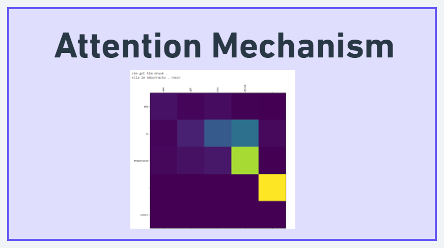

 
  

<h2 id="intro">Shortcomings of Seq2Seq model without Attention</h2>

 
 When we pass our sentence to encoder, the encoder encodes the complete information of source sequence into a single valued vector called context vector.

 
   This context vector is then passed to decoder to produce an output sequence in target language. The context vector is responsible to summarize entire input sequence into one context vector.

 
    This context vector can not hold entire source information if input sequence is too long.

<h2 id="intro">Introduction to  Attention</h2>

 
 Attention allows model to selectively focus on different parts of input during processing. The main idea behind is to avoid attempting to learn a single vector representation for each sentence, instead it pays attention to specific input vectors of input based on attention weights.

 
   At every decoding step the decoder will be informed how much attention needs to paid to each input word using set of input weights. This attention weights gives contextual information to decoder for translation.

(<a href="#readme-top">back to top</a>)

<h2 id="intro">Main components of Attention </h2>

 
 1. Query = It represents the current state of the model or the element of input that requires attention.

 
2. Key = A set of vectors that represent the input elements or context.

 
3. Value: A set of vectors that represent the information associated with the input elements.

<h2 id="intro">How it works? </h2>

 *  The attention mechanism computes the similarity between the query and the keys, and then uses these similarities to compute weights or attention scores for the values.

*  These weights are then used to linearly combine the values to obtain the context vector, which is then used by the model for further processing.

(<a href="#readme-top">back to top</a>)

