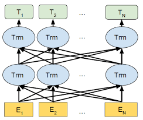
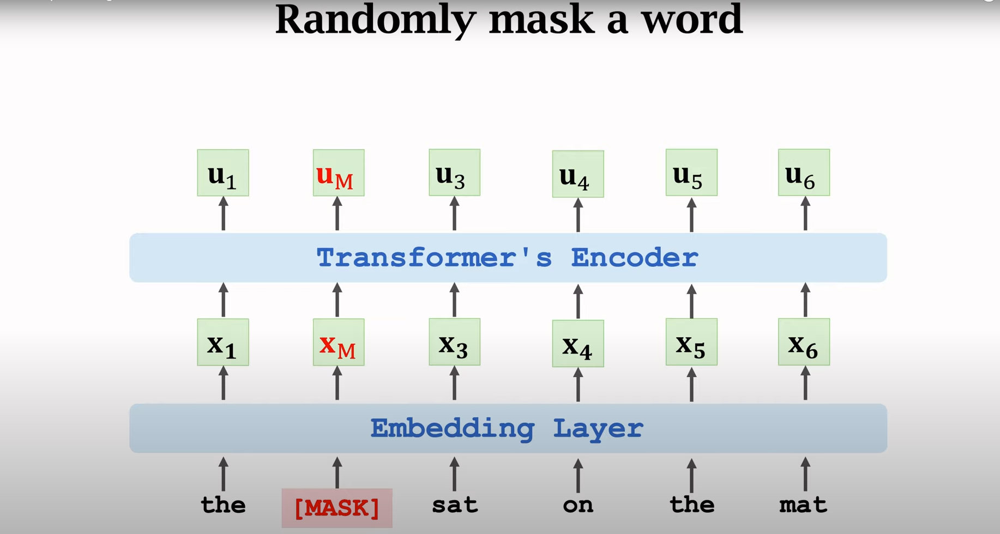
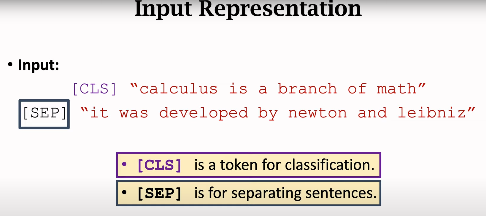
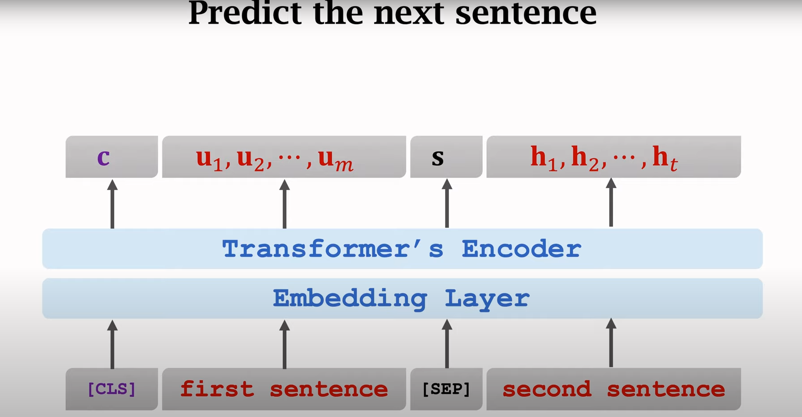
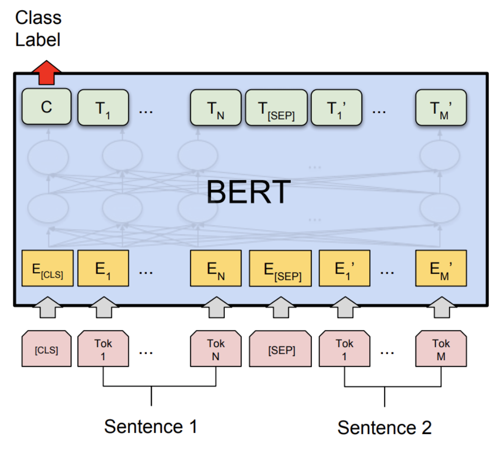

<h1 align="center">Introduction to BERT(Bidirectional Encoder Representations from Transformers)</h1>

 
  

<h2 id="intro" >INTRODUCTION </h2>

 
  BERT is Bidirectional Encoder Representations from Transformers.BERT is a language representation model that is trained on a large corpus of text data in an unsupervised manner.

    It utilizes the transformer architecture, which is a type of neural network architecture that allows for parallel processing of input data and has been shown to be highly effective in modeling sequential data, such as natural language text..

   The key innovation of BERT is its bidirectional training approach, which allows the model to learn from both left-to-right (forward) and right-to-left (backward) context of words in a sentence. This bidirectional training enables BERT to capture rich contextual representations of words, which can be used to improve the performance of a wide range of NLP tasks

(<a href="#readme-top">back to top</a>)

<h2 id="intro" >How BERT Solves  a problem ?</h2>
<li>
   <b>PRETRAIN BERT to understand language</b>
</li>
<li>
   <b>FINE TUNE BERT to learn specific task</b>
</li>

 
  

 
<b>PRETRAIN BERT to understand language</b>

  + `Goal here is to make BERT learn what  is language and what is context`
  + `BERT learns language by two unsupervised tasks simultaneously`
  
    <b>Masked Language Model(MLM)</b>
      + `For this task BERT takes input as sentence with masks. The goal is to output this mask tokens. `
      + `It helps BERT understanding Bidirecitonal context`
     
    
 
    
    

     
    <li align='center'>Each time BERT randomly one word or multiple words in a sentence. </li>
    <li align='center'>A word is then replace by masked token [MASK]</li>
    <li align='center'>In original paper they randomly put 15% of input data as [MASK]</li>
    <li align='center'>We feed our output vector U(M) to a softmax classifier, It performs multiclass classification</li>
    <li align='center'>Number of classes are vocabulary size</li>

    
    + `e = one-hot vector of masked word`
    + `p = output probability distribution`
    + <b>`LOSS= CrossEntropy(e,p)` </b>
    
     

    <b>Next Sentence Prediction </b>
      + `BERT takes in two sentences and it determines second sentence actually follows the first sentence.`
      + `This help BERT to get context across different sentences themselves. `
     
    
 
    
    

     
     <li align='center'>There are 2 token used in this approch ie. [CLS] and [SEP] </li>
     <li align='center'> [CLS] Token is used for binary class classification which tell whether 2nd sentence is consecutive to first or not </li>
     <li align='center'>If 2nd sentence follows 1st then our classification output would be True, we set Target = True otherwise False</li>
     
    
    <li align='center'>The input sequence is first feed into an embedding layer then into transformer's encoder layer.</li>
    <li align='center'>Output is sequence of vectors, Each vector is in the position of input token</li>
    <li align='center'>For ex vector Um is in the position of last word of first sentence another ex vector c is in position of [CLS] token</li>
    <li align='center'>Vecotr c depends upon input sequence, It has full knowledge of two sentences. Thus based on vector c binary classifier can tell whether 2nd sentence is the real sentence or not    </li>

  

(<a href="#readme-top">back to top</a>)

<h2 id="Intro" > FINE TUNE BERT to learn specific task</h2>

 
  

 

 
<b></b>

  + `We can now fine tune BERT on very specific NLP task such as Question-Answering`
  + `All we need to do is to replace the fully connected output layers of the network with fresh set of output layer.That can output answer to a question `
  + `Then we can perform supervised training using a dataset. It wont take long to get train because its only the output parameters that are learned from scratch.The rest of model parameters  are slightly fine tunned. As a result training time is fast.`
  

(<a href="#readme-top">back to top</a>)

<h2 id="Applications" > Applications of BERT in NLP</h2>

<b>Text Classification :</b>

BERT can be used for text classification tasks such as sentiment analysis, spam detection, topic classification, and intent recognition. BERT's ability to capture contextualized word representations helps improve the accuracy of these tasks by taking into account the meaning of words in their context.

<b>Named Entity Recognition (NER)</b>

BERT can be used for NER tasks, where the goal is to identify and classify named entities such as names of people, organizations, and locations in text. BERT's contextualized embeddings can help in identifying and extracting named entities with high accuracy.

<b>Text Generation :</b>

BERT can be used for text generation tasks such as language modeling, text completion, and text summarization. BERT's ability to capture contextualized representations can help in generating coherent and contextually appropriate text.

<b>Question Answering :</b>

BERT has been used for question answering tasks, where the model is trained to understand questions and provide relevant answers. This is particularly useful in applications like chatbots, customer support systems, and search engines

<b>Text Similarity and Semantic Similarity :</b>

BERT can be used to measure text similarity or semantic similarity between two or more pieces of text. This is useful in applications like duplicate detection, plagiarism detection, and information retrieval systems.

<b>Document Classification :</b>

BERT can be used for classifying entire documents into predefined categories or topics. This can be useful in tasks such as news categorization, document tagging, and content recommendation.

<b>Machine Translation :</b>

BERT can be used in machine translation tasks, where the goal is to automatically translate text from one language to another. BERT's contextualized embeddings can help in capturing the nuances of different languages and improve translation quality.

<b>Sentiment Analysis :</b>

in Social Media: BERT can be used to analyze sentiment in social media data, such as tweets and comments, to understand public opinion, monitor brand sentiment, and track social media trends.

(<a href="#readme-top">back to top</a>)

