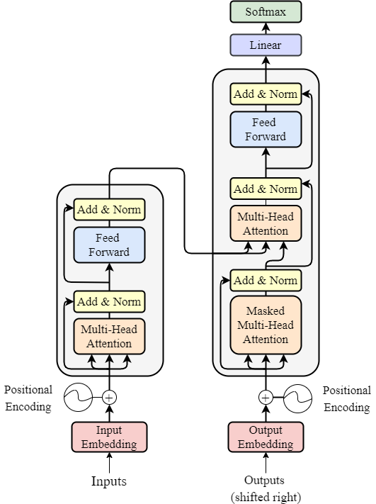

<h1 align="center">Intro to Transformer</h1>

 
  

<h2 id="intro" >INTRODUCTION </h2>

 
  When most people hear the term Transformer, they may think of robots that change shape and turn into vehicles—just like in the popular movie franchise.However, in this article, we will be looking at a different kind of Transformer - one that is used for natural language processing (NLP) tasks.

   One of the most groundbreaking deep learning architectures that has transformed NLP is the Transformer. In this blog post, we will provide a comprehensive overview of Transformers, explaining their core concepts and applications in a simplified manner, so that students and beginners in the field of data science can grasp the fundamentals of this revolutionary technology.

<h3 id="intro" >What is a Transformer?</h3>
At its core, a Transformer is a type of deep learning architecture that replaces traditional recurrent neural networks (RNNs) for sequence-to-sequence tasks, such as machine translation, sentiment analysis, and text generation. Transformers were introduced by Vaswani et al. in the seminal paper <a href = "https://arxiv.org/abs/1706.03762">"Attention is All You Need"</a> in 2017. Unlike RNNs, which process text sequentially, Transformers process input text in parallel, making them highly efficient for long sequences. The key innovation of Transformers is self-attention, which allows the model to weigh the importance of different words in a sentence when processing them, leading to more contextual understanding.

(<a href="#readme-top">back to top</a>)

<h2 id="Intro" > Reason we need transformers</h2>

 
  

 
<b>Efficiency in Processing Long Sequences:</b>

   + `Unlike traditional recurrent neural networks (RNNs), which process text sequentially, Transformers can handle long sequences by processing input in parallel, such as machine translation or document summarization`
    
**Ability to Capture Long-Range Dependencies**

+ `Self-attention mechanisms allow Transformers to weigh the importance of different words in a sentence relative to each other—this captures long range dependencies and contextual relationships between words, allowing them better understand complex sentences or documents.`
  
<b>Scalability and Parallelizability</b>

+ `Because of their ability to scale up, transformers can be used with large datasets and complex tasks. In addition, they can be parallelized across multiple GPUs or even distributed across multiple machines—allowing efficient training on large datasets as well as reducing training time.`

<b>State-of-the-Art Performance</b>

+ `Transformers have achieved state-of-the-art performance on a variety of NLP tasks, such as machine translation, question answering, and text generation.`

(<a href="#readme-top">back to top</a>)

<h2 id="Intro" > What is Attention and Types of Attention in Transformers?</h2>

 
  

Deep learning models use a mechanism called attention to focus on different parts of input data depending on their relevance for solving the task at hand. In Transformers, self-attention is applied over each word in a sentence to compute its own representation—considering how it relates with other words.

**There are two types of attention used:**

1. <b>Self-Attention :</b>

        Self-attention, also known as intra-attention, calculates the relative importance of words within a sentence. Self-attention considers how each word relates to all other words in its context and assigns attention scores accordingly. This makes the model more flexible and dynamic than traditional approaches to capturing contextual dependencies between words.

2. <b>Multi-Head Attention :</b>

Multi-head attention is a variant of self-attention that allows the model to attend differently depending on different perspectives. Each perspective learns its own set of attention patterns—as opposed to learning one big master pattern for all possible inputs, like in standard Attention models. This enables the model to capture a broader range of data and produce more accurate predictions.

(<a href="#readme-top">back to top</a>)

<h2 id="Applications" > Applications of Transformer in NLP</h2>

<b>Machine Translation :</b>

Machine translations is a task to translate the text from one language to anthore lanuague here it use the Encoder-Decoder architecture to translate the text from one language to another language.

<b>Text Summarization :</b>

Text summarization is a task to summarize the text from a large text to a small text here it uses different techniques to summarize the text or architecture like Encoder-Decoder architecture for  Extractive Summarization,  and Abstractive Summarization

<b>Text Generation :</b>

Text generation is a task to generate the text from a given text here it uses different techniques to generate the text or architecture like T5 , GPT-2.

<b>Question Answering :</b>

Question answering is a task to answer the question from a given text here it uses different techniques to answer the question or architecture like BERT,T5 ,Gpt-3

<b>Text Classification :</b>

Text classification is a task to classify the text into different classes here it uses different techniques to classify the text or architecture like BERT,DistilBERT, RoBERTa, XLNet, XLM, ALBERT, CamemBERT, ELECTRA, FlauBERT, Longformer, Reformer, and T5.

(<a href="#readme-top">back to top</a>)

<h2 id="Intro" > Advancement in Transformer in 2023  </h2>

By using the Transformer like Gpt-3 and Gpt- 4 and some other transformer model we can do some advance task like
<ol>
<li>
<b>Text to Image Generation : DALL-E </b>
</li>
<li>
<b>Image to Text Generation : Make-A-Video</b>
</li>
<li>
<b>Text to Audio Generation : AudioLDM</b>
</li>
<li>
<b>Audio to Text Generation :wisper</b>
</li>

</li>

